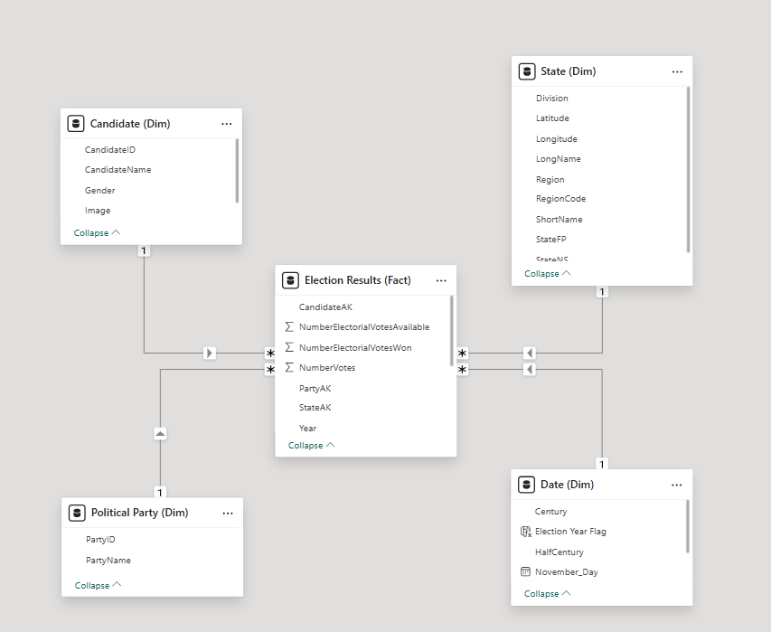

# U.S. Presidential Elections Analysis – Power BI Report

This project analyzes historical U.S. presidential election data (1820–2004), exploring voting trends, party dominance and state-level results 
through an interactive Power BI report.  

---

## Project Structure

- `presidential-elections-analysis.pbix` – Power BI report  
- `datasets/presidential_elections.xlsx` – Election dataset  
- `screenshots/` – Report pages and data model  

---

## Data Model
Star schema design, optimized for performance and scalability.

- **Election Results (Fact)** – main table storing all election results
- **Candidate (Dim)** – connected 1-to-many to Fact via CandidateAK
- **State (Dim)** – connected 1-to-many to Fact via StateAK
- **Political Party (Dim)** – connected 1-to-many to Fact via PartyAK
- **Date (Dim)** – connected 1-to-many to Fact via Year

---

## Report Pages
- **Elections** – overview of all election results by year and party
- **Maps** – U.S. map showing which party won each state
- **Politicians** – ranking of candidates by electoral votes
- **A.I.** – decomposition trees analyzing votes by party, region, and state
- **Electoral Changes** – long-term trends in electoral and popular votes over time

---

## Business Questions Answered
- How have electoral and popular votes changed over time?
- Which candidates won the most electoral votes?
- Which party won each state?
- How has the power of parties evolved over time?
- What are the electoral vote breakdowns by region and state?
- How many total votes were cast across all elections?

---

## Technologies

- Microsoft Power BI Desktop  
- Power Query  
- DAX   
- Excel
